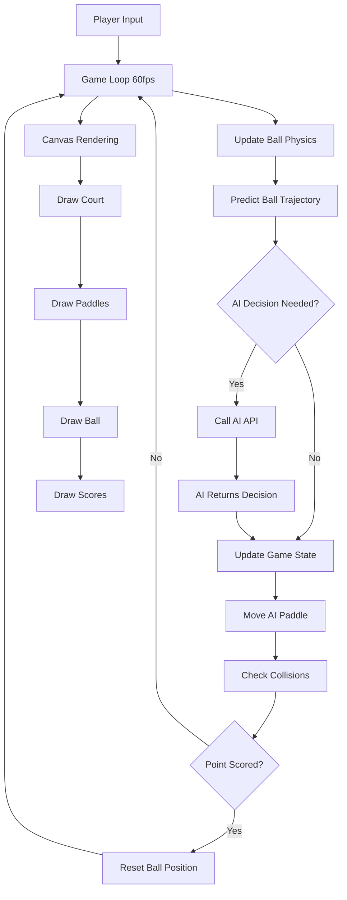

# 🎾 Tennis0

AI-powered tennis game where you play against different LLM models through Vercel AI Gateway.

## Features

- Play tennis against 25+ different AI models
- Real-time AI decision making with strategic reasoning
- Beautiful tennis court graphics with realistic physics
- Mobile and desktop support
- Model selection from various providers (OpenAI, Meta, Google, Mistral, etc.)

## Setup

1. Get your AI Gateway API key from [Vercel AI Gateway](https://vercel.com/ai-gateway)

2. Create a `.env.local` file in the project root:
```bash
AI_GATEWAY_API_KEY=your_ai_gateway_api_key_here
```

3. Install dependencies and run:
```bash
npm install
npm run dev
```

4. Open [http://localhost:3000](http://localhost:3000) to play

## How to Play

- **Desktop**: Move your mouse to control the paddle
- **Mobile**: Touch and drag to move your paddle
- First to 5 points wins!
- Choose different AI models to experience different playing styles

## How It Works



### Game Architecture Flow

1. **Player Input**: Mouse/touch movements control the player's paddle
2. **Game Physics**: Ball movement, collisions, and trajectory calculations
3. **AI Decision Making**: When needed, API calls to LLM models for paddle positioning
4. **State Management**: Game state updates with scores, positions, and game status
5. **Visual Rendering**: Real-time canvas drawing of the tennis court and elements

## AI Models Available

The game uses Vercel AI Gateway to access models from:
- **OpenAI**: GPT-4o Mini, GPT-5 Nano, GPT-4.1 Nano
- **Meta**: Llama 3.3 70B, Llama 4 Scout, Llama 4 Maverick  
- **Google**: Gemini 2.0 Flash, Gemini 2.5 Flash Lite
- **Mistral**: Ministral 3B/8B, Codestral, Devstral Small
- **Amazon**: Nova Micro, Nova Lite
- **Alibaba**: Qwen 3 14B/30B/32B
- **DeepSeek**: DeepSeek V3
- **xAI**: Grok 3 Mini
- **Cohere**: Command R

Each model has its own playing personality and strategy!

## Learn More

To learn more about Next.js, take a look at the following resources:

- [Next.js Documentation](https://nextjs.org/docs) - learn about Next.js features and API.
- [Learn Next.js](https://nextjs.org/learn) - an interactive Next.js tutorial.

You can check out [the Next.js GitHub repository](https://github.com/vercel/next.js) - your feedback and contributions are welcome!

## Deploy on Vercel

The easiest way to deploy your Next.js app is to use the [Vercel Platform](https://vercel.com/new?utm_medium=default-template&filter=next.js&utm_source=create-next-app&utm_campaign=create-next-app-readme) from the creators of Next.js.

Check out our [Next.js deployment documentation](https://nextjs.org/docs/app/building-your-application/deploying) for more details.
